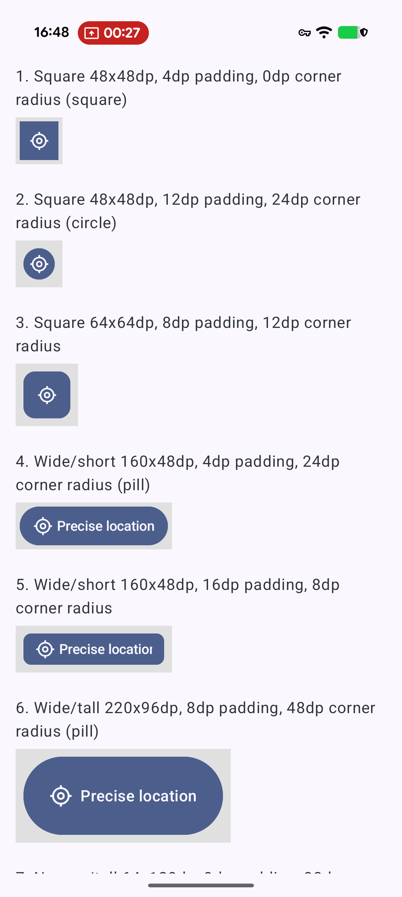
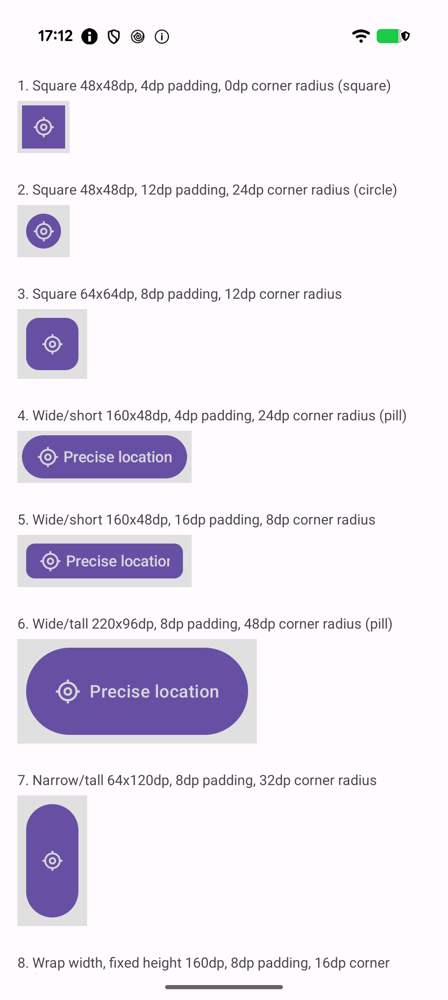
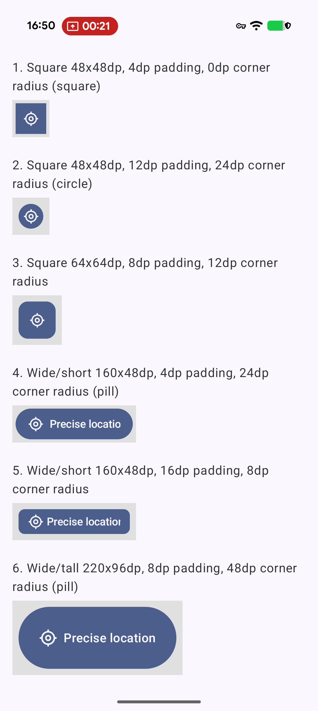
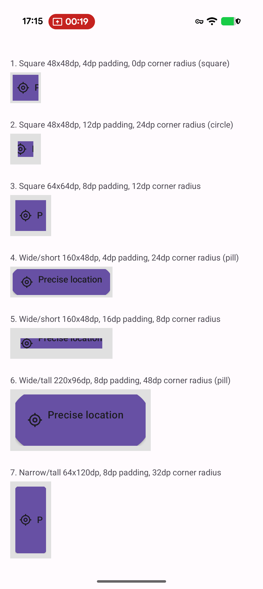
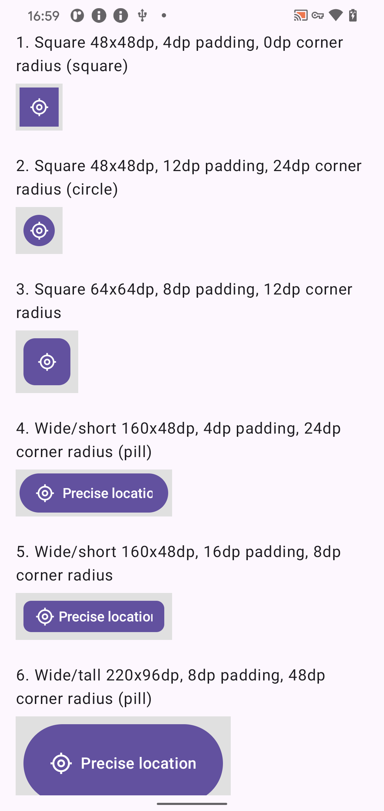
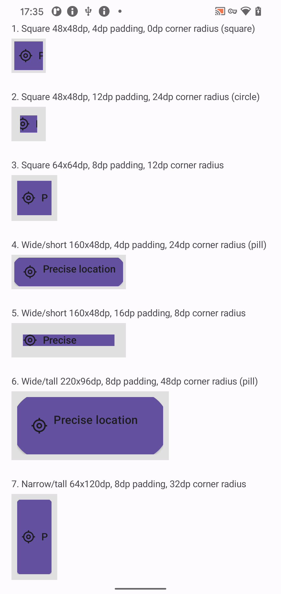

# LocationButtonLowerAndroidVersions

> Built with Claude Code.

Two apps (`:app` — Compose, `:app-views` — Views) that both render the same grid of
`androidx.core.locationbutton.LocationButton` instances across a matrix of sizes,
paddings, and corner radii, for visual comparison across Android versions.

## The issue

Issue tracker: https://issuetracker.google.com/issues/567953859

On Android 17 (API 37), `LocationButton` renders as the real system-secure button. On
older versions the library falls back to a compat rendering. That compat fallback has
UI bugs that don't affect the API 37 path — and so far only reproduce in the **Views**
app (`:app-views`), not the Compose one (`:app`):

- **Corner-radius/padding isn't applied correctly** — the button's rounded background
  doesn't line up with its actual view bounds, leaving visible gaps or clipping at the
  corners.
- **Text isn't centered with the icon** — the icon + label pairing that's centered on
  API 37 is off-center on the compat rendering.

Each button sits inside a grey box matching its exact width/height, so any grey showing
through the button's rounded background is the corner-radius/padding bug made visible,
and icon/text alignment can be checked directly against that flat background.

Run the same app on an Android 17 device/emulator and on an older one, and compare
screenshots row by row.

## Screenshots

| Device / Android version | Compose (`:app`) | Views (`:app-views`) |
| --- | --- | --- |
| Pixel 10 Pro — Android 17 (API 37) |  |  |
| Pixel 10 Pro — Android 16 (API 36) |  |  |
| Pixel 4 — Android 11 (API 30) |  |  |

On API 30 and API 36, the Views compat rendering shows the bug clearly: corner radii
render as chamfered/octagonal corners instead of proper curves (most visible on the
"circle" and "pill" scenarios), and the label text is mispositioned relative to the
icon — overlapping it or clipping down to a single stray character — instead of sitting
centered beside it. The Compose app renders correctly at every version tested, and on
API 37 both apps use the real system button and render correctly.
